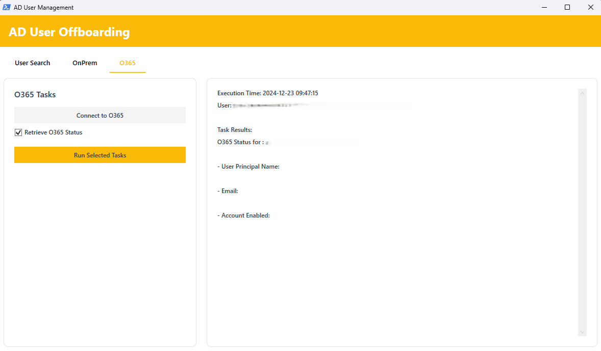

# AD User Offboarding Tool

<div align="center">
    
</div>

## About
A PowerShell-based GUI tool for managing user offboarding in both Active Directory and Office 365 environments. Designed to work across multiple Windows architectures including x86, x64, and ARM.

## Architecture Support
The tool automatically adapts to your system architecture:
- ✅ **x64 (64-bit)**: Full AD PowerShell module support
- ✅ **x86 (32-bit)**: Full AD PowerShell module support
- ✅ **ARM64**: LDAP-based access (Windows 11 ARM)

## Features
- 🖥️ Modern WPF interface using styling
- 🔒 Secure authentication for both AD and O365
- 🔄 Automatic architecture detection and adaptation
- 📊 Real-time task execution feedback
- ⚡ Support for both AD Module and LDAP approaches

## Screenshots

<div align="center">
    
    <p><em>Login Screen</em></p>
</div>

<div align="center">
    
    <p><em>Main Interface</em></p>
</div>

## Prerequisites
- Windows PowerShell 5.1 or later
- One of the following:
  - Windows 10/11 (x64/x86) with AD PowerShell module
  - Windows 11 ARM with RSAT tools
- Microsoft Graph PowerShell module (auto-installed if needed)
- Appropriate AD and O365 permissions

## Installation

```powershell
# Clone the repository
git clone https://github.com/CreativeAcer/OffboardingManager.git

# Navigate to the directory
cd OffboardingManager
```

## Project Structure
```plaintext
/OffboardingManager/
├── Start-Offboarding.ps1           # Main script
├── Launch-Offboarding.ps1          # Launcher script
├── Config/                         # Configuration files
│   ├── Colors.ps1                  # Color scheme
│   ├── Fonts.ps1                   # Font definitions
│   └── Settings.ps1                # Global settings
├── Functions/                      # Core functionality
│   ├── Environment.ps1             # Architecture detection
│   ├── LDAP/                       # LDAP support
│   │   ├── LDAPConnection.ps1
│   │   └── LDAPUsers.ps1
│   └── UI/                        # UI functionality
│       ├── LoginDialog.ps1
│       ├── MainWindow.ps1
│       ├── OnPremHandlers.ps1
│       ├── O365Handlers.ps1
│       ├── XAMLHelper.ps1
│       └── EasterEgg.ps1          # well not yet
├── XAML/                          # UI definitions
│   ├── LoginWindow.xaml
│   └── MainWindow.xaml
├── Logs/                         # Application logs
│   └── error_log.txt
└── docs/                         # Documentation
└── images/                   # Screenshots
├── MainWindow2.png       # Main banner
├── Login.png            # Login screen
└── MainWindow.png       # Main interface
```
