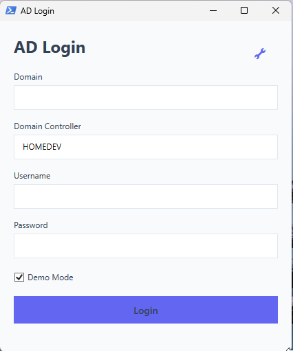
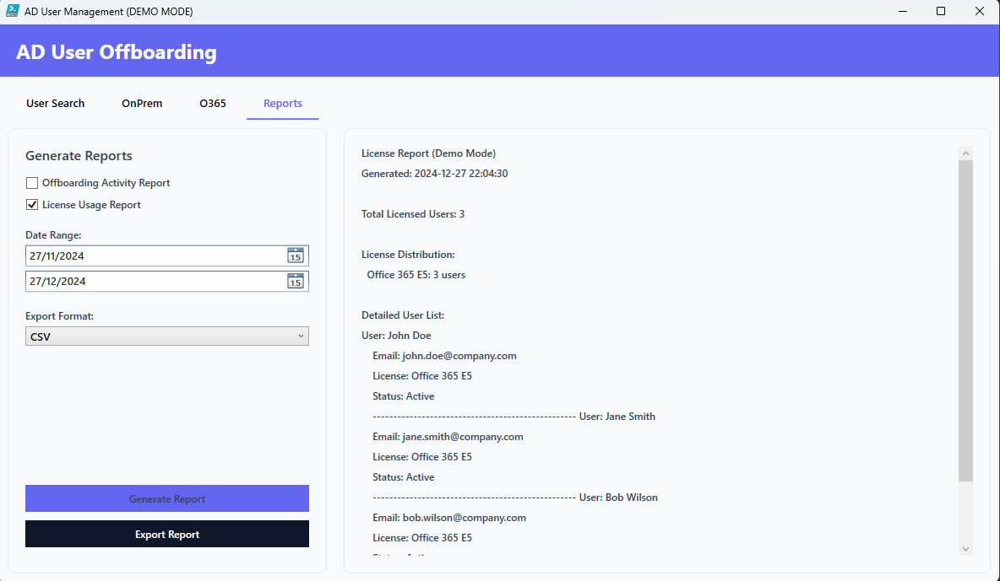

# AD User Offboarding Tool

<div align="center">
    
</div>

## About
A PowerShell-based GUI tool for managing user offboarding in both Active Directory and Office 365 environments. Designed to work across multiple Windows architectures including x86, x64, and ARM.

This script is still being developed, so changes occur frequently and features are added over time.

## Architecture Support
The tool automatically adapts to your system architecture:
- ✅ **x64 (64-bit)**: Full AD PowerShell module support
- ✅ **x86 (32-bit)**: Full AD PowerShell module support
- ✅ **ARM64**: LDAP-based access (Windows 11 ARM)

## Features
- 🖥️ Modern WPF interface using styling
- 🔒 Secure authentication for both AD and O365
- 🔄 Automatic architecture detection and adaptation
- 📊 Real-time task execution feedback and report export
- ⚡ Support for both AD Module and LDAP approaches

## Screenshots

Screenshots can be outdated due to features being added!

<div align="center">
    
    <p><em>Login Screen</em></p>
</div>

<div align="center">
    
    <p><em>On Premise options</em></p>
</div>

<div align="center">
    
    <p><em>O365 Options</em></p>
</div>

<div align="center">
    
    <p><em>Reporting</em></p>
</div>

## Prerequisites
- Windows PowerShell 5.1 or later
- One of the following:
  - Windows 10/11 (x64/x86) with AD PowerShell module
  - Windows 11 ARM with RSAT tools
- Microsoft Graph PowerShell module (auto-installed if needed)
- Appropriate AD and O365 permissions

## Installation

```powershell
# Clone the repository
git clone https://github.com/CreativeAcer/OffboardingManager.git

# Navigate to the directory
cd ADUserOffboarding
```

## Project Structure
```plaintext
/ADUserOffboarding/
├── Start-Offboarding.ps1
├── Launch-Offboarding.ps1
├── Create-OffboardingShortcut.ps1
├── Create-Shortcut.bat
├── Config/
│   ├── Colors.ps1
│   ├── Fonts.ps1
│   └── Settings.ps1
├── Functions/
│   ├── Environment.ps1
│   ├── LDAP/
│   │   ├── LDAPConnection.ps1
│   │   └── LDAPUsers.ps1
│   ├── UI/
│   │   ├── LoginDialog.ps1
│   │   ├── MainWindow.ps1
│   │   ├── MainWindow/
│   │   │   ├── Initialize-MainWindow.ps1
│   │   │   ├── Update-UserList.ps1
│   │   │   ├── Update-SelectedUser.ps1
│   │   │   └── Show-UserDetails.ps1
│   │   └── OnPremHandlers.ps1
│   │   └── O365Handlers.ps1
│   │   └── ReportHandlers.ps1
│   │   └── XAMLHelper.ps1
│   │   └── EasterEgg.ps1
│   └── Logging/
│       └── Write-ActivityLog.ps1
├── XAML/
│   ├── LoginWindow.xaml
│   └── MainWindow.xaml
├── Logs/
│   └── error_log.txt
├── Reports/
│   └── date.csv
└── docs/
    └── images/
        ├── MainWindow2.png    # Main banner
        ├── Login.png          # Login screen
        └── MainWindow.png     # Main interface
```
