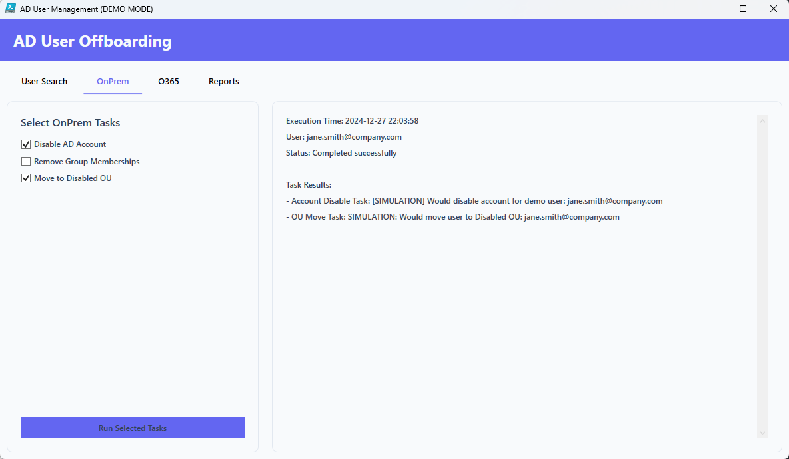

# AD User Offboarding Tool

<div align="center">
    
</div>

## About
A PowerShell-based GUI tool for managing user offboarding in both Active Directory and Office 365 environments. Designed to work across multiple Windows architectures including x86, x64, and ARM. Features a demo mode for testing and training purposes.

This script is actively being developed, with frequent updates and new features.

## Architecture Support
The tool automatically adapts to your system architecture:
- ✅ **x64 (64-bit)**: Full AD PowerShell module support
- ✅ **x86 (32-bit)**: Full AD PowerShell module support
- ✅ **ARM64**: LDAP-based access (Windows 11 ARM)

## Features
- 🖥️ Modern WPF interface with sleek styling
- 🔒 Secure authentication for both AD and O365
- 🔄 Automatic architecture detection and adaptation
- 📊 Comprehensive reporting system with CSV export
- ⚡ Support for both AD Module and LDAP approaches
- 🎯 Demo mode for testing and training
- 📝 Activity logging and audit trails
- 🔄 Real-time task execution feedback

### On-Premises Features
- Disable AD accounts
- Remove group memberships
- Move to disabled OU
- Automatic logging of all actions

### O365 Features
- Microsoft Graph integration
- Mailbox Management
  - Convert to shared mailbox
  - Mail forwarding
  - Configure auto reply
- License management reporting
- User status verification
- Secure connection handling

### Reporting Capabilities
- Offboarding activity reports
- License usage reports
- Date range filtering
- Export to CSV
- Detailed user activity tracking

## Demo Mode
Test the application's functionality without affecting your AD environment:
- Simulated AD operations
- Mock user data
- Safe testing environment
- Training purposes
- No actual AD modifications

## Screenshots

Screenshots may be outdated due to continuous development!

<div align="center">
    
    <p><em>Login Screen</em></p>
</div>

<div align="center">
    
    <p><em>On Premise options</em></p>
</div>

<div align="center">
    
    <p><em>O365 Options</em></p>
</div>

<div align="center">
    
    <p><em>Reporting</em></p>
</div>

## Prerequisites
- Windows PowerShell 5.1 or later
- One of the following:
  - Windows 10/11 (x64/x86) with AD PowerShell module
  - Windows 11 ARM with RSAT tools
- Microsoft Graph PowerShell module (auto-installed if needed)
- Appropriate AD and O365 permissions
- Internet connection for O365 features

## Installation

```powershell
# Clone the repository
git clone https://github.com/CreativeAcer/OffboardingManager.git

# Navigate to the directory
cd ADUserOffboarding

# Optional: Create desktop shortcut
.\Create-Shortcut.bat
- runs Create-OffboardingShortcut.ps1
```

## Development Status
- [x] Basic UI Implementation
- [x] AD Integration
- [x] O365 Basic Integration
- [x] Cross-Architecture Support
- [x] Demo Mode Implementation
- [x] Reporting System
- [x] Activity Logging
- [ ] Advanced O365 Features (In Development)
- [ ] Bulk Operations (Planned)
- [ ] Enhanced Reporting Features (Comming Soon)

## Backlog
These items might change the scope of this project
### General functionality
- [ ] (bulk)Creation of user
### Teams & SharePoint
- [ ] Remove from Teams groups
- [ ] Transfer Teams ownership
- [ ] Archive Teams channels
- [ ] Remove SharePoint permissions
- [ ] Transfer OneDrive ownership
- [ ] Back up OneDrive content

### License Management
- [ ] License reassignment
- [ ] License cost analysis
- [ ] License usage optimization
- [ ] Product-specific disabling
- [ ] Bulk license management

### Security & Compliance
- [ ] Revoke app permissions
- [ ] Remove MFA devices
- [ ] Clear mobile device list
- [ ] Export mailbox audit logs
- [ ] Set litigation hold
- [ ] Generate security reports

### Device Management
- [ ] Remove from Intune
- [ ] Wipe enrolled devices
- [ ] Revoke certificates
- [ ] Remove Azure AD devices
- [ ] Clear cached credentials
- [ ] Device compliance report

### Automation Features
- [ ] Scheduled offboarding
- [ ] Conditional task execution
- [ ] Custom workflow builder
- [ ] Email notifications
- [ ] Manager approvals
- [ ] Integration with ticketing systems

## Contributing
Feel free to submit issues, fork the repository and create pull requests for any improvements.

## Usage
1. Launch the application using Start-Offboarding.ps1 or the desktop shortcut
2. Login with AD credentials or select Demo Mode
3. Select a user from the list
4. Choose operations from available tabs:
  - **On-Premises Tasks**
    - Disable AD account
    - Remove group memberships
    - Move to disabled OU
  - **O365 Management**
    - Connect to Microsoft Graph
    - Mailbox Management
    - View license status
  - **Report Generation**
    - Generate activity reports
    - Export license reports
5. Execute selected tasks
6. Review real-time feedback
7. Export reports as needed

## Reporting System
### Available Reports
- **Offboarding Activity Report**
 - Track all offboarding actions
 - Filter by date range
 - View success/failure status
 - Export to CSV

- **License Usage Report**
 - Current license assignments
 - License distribution overview
 - User license details
 - Export capabilities

### Report Features
- Date range filtering
- Multiple export formats
- Detailed audit trails
- Real-time generation
- Searchable results
- Error tracking
- Activity summaries

### Export Options
- CSV format support
- Structured data output
- Timestamp inclusion
- Detailed metadata
- Audit compatibility

## Project Structure
```plaintext
/ADUserOffboarding/
├── Start-Offboarding.ps1
├── Launch-Offboarding.ps1
├── Create-OffboardingShortcut.ps1
├── Create-Shortcut.bat
├── Config/
│   ├── Colors.ps1
│   ├── Fonts.ps1
│   └── Settings.ps1
├── Functions/
│   ├── Environment.ps1
│   ├── LDAP/
│   │   ├── LDAPConnection.ps1
│   │   └── LDAPUsers.ps1
│   ├── Utilities/
│   │   ├── Mockdata.ps1
│   │   └── PathUtils.ps1
│   ├── UI/
│   │   ├── LoginDialog.ps1
│   │   ├── MainWindow.ps1
│   │   ├── O365/              # O365 specific functions
│   │   │   └── MailboxManagement.ps1
│   │   ├── MainWindow/
│   │   │   ├── Initialize-MainWindow.ps1
│   │   │   ├── Update-UserList.ps1
│   │   │   ├── Update-SelectedUser.ps1
│   │   │   └── Show-UserDetails.ps1
│   │   ├── OnPremHandlers.ps1
│   │   ├── O365Handlers.ps1
│   │   ├── ReportHandlers.ps1
│   │   ├── XAMLHelper.ps1
│   │   └── EasterEgg.ps1
│   └── Logging/
│       └── Write-ActivityLog.ps1
├── XAML/
│   ├── LoginWindow.xaml
│   └── MainWindow.xaml
├── Logs/
│   └── error_log.txt
├── Reports/
│   └── date.csv
└── docs/
    └── images/
        ├── MainWindow2.png    # Main banner
        ├── Login.png          # Login screen
        └── MainWindow.png     # Main interface
```
## Acknowledgments
- PowerShell Community for inspiration and examples
- Microsoft Graph API Documentation
- Active Directory PowerShell Module Documentation
- Contributors and testers providing valuable feedback